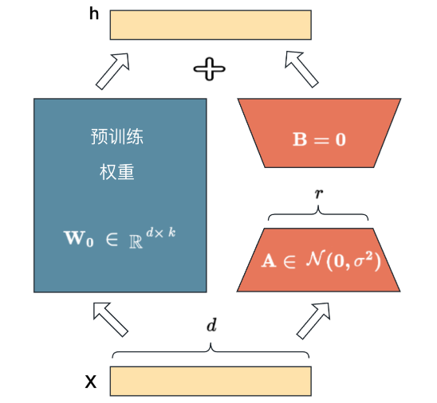

## 一、finetune简介

大模型微调可以使用较小的成本得到垂直领域的专用大模型，对于没有大量显卡可以训练大模型的中小型企业有着广泛的应用价值。目前主流的方法包括2019年 Houlsby N 等人提出的 Adapter Tuning，2021年微软提出的 LORA，斯坦福提出的 Prefix-Tuning，谷歌提出的 Prompt Tuning，2022年清华提出的 P-tuning v2。

### 1. LORA

LORA(Low Rank Adaptation of LLM)思想来源于模型是过参数化的，它们有更小的内在维度，模型主要依赖于这个低的内在维度（low intrinsic dimension）去做任务适配。因此提出了低秩的自适应方法。LoRA 允许我们通过优化适应过程中密集层变化的秩分解矩阵，来间接训练神经网络中的一些密集层，同时保持预先训练的权重不变。

LORA思路
- 在原始的预训练权重旁边增加一个旁路，做一个降维再升维的操作，来模型大模型的低秩表征。
- 训练时固定预训练模型的参数，只训练$A$和$B$网络，保证模型的输入输出维度不变。最终的结果为预训练模型输出与$AB$网络输出的和。其中$A$网络参数用高斯分布初始化，$B$网络参数用0初始化。



### 2. Adapter Tuning

在预训练模型每一层(或某些层)中添加Adapter模块，微调时冻结预训练模型主体，由Adapter模块学习特定下游任务的知识。每个Adapter模块由两个前馈子层组成，第一个前馈子层将Transformer块的输出作为输入，将原始输入维度d投影到m，通过控制m的大小来限制Adapter模块的参数量，通常情况下m<<d。在输出阶段，通过第二个前馈子层还原输入维度，将m重新投影到d，作为Adapter模块的输出(如上图右侧结构)。通过添加Adapter模块来产生一个易于扩展的下游模型，每当出现新的下游任务，通过添加Adapter模块来避免全模型微调与灾难性遗忘的问题。Adapter方法不需要微调预训练模型的全部参数，通过引入少量针对特定任务的参数，来存储有关该任务的知识，降低对模型微调的算力要求。


### 3. QLORA

QLORA可以节约数十倍的显存且几乎没有损失性能通过这种方式，可以在单个48G的GPU显卡上微调65B的参数模型，采用这种方式训练的模型可以保持16字节微调任务的性能。QLoRA通过冻结的int4量化预训练语言模型反向传播梯度到低秩适配器LoRA来实现微调。创新点如下

- **引入新的数据类型4bit NormalFloat**：它是建立在 Quantile quantization基础上的，是一种信息论上的最优数据类型，确保每个量化区间从输入张量中分配相同数量的值。分位数量化通过经验累积分布函数估计输入张量的分位数来工作。
- **双重量化以减少平均内存占用**：二次量化做到了 0.127 bit per parameter，比一次量化进一步节约了 0.373 bit per parameter.
- **分页优化器来管理内存峰值**：NVIDIA的统一内存特性可以在GPU RAM偶尔不足的情况下，实现CPU和GPU之间的数据传输，以确保GPU处理过程无误。这个特性类似于CPU RAM和磁盘之间的常规内存分页。Qlora利用这个特性，当GPU RAM不足时，把数据转移到CPU RAM，并在优化器更新步骤中需要的时候重新拿回GPU中。


## 二、XTuner

一个大语言模型微调工具箱。由 MMRazor 和 MMDeploy 联合开发。

- 傻瓜化： 以 配置文件 的形式封装了大部分微调场景，0基础的非专业人员也能一键开始微调。
- 轻量级： 对于 7B 参数量的LLM，微调所需的最小显存仅为 8GB

使用了Flash Attention和Deepspeed，可以优化显存占用。8G可玩


## 三、实验操作

### 1. 环境配置

拷贝conda环境，下载InterLM-7B大模型。

### 2. 数据准备

将数据集集制作成如下格式：

```bash
[{
    "conversation":[
        {
            "system": "xxx",
            "input": "xxx",
            "output": "xxx"
        }
    ]
},
{
    "conversation":[
        {
            "system": "xxx",
            "input": "xxx",
            "output": "xxx"
        }
    ]
}]
```

### 3. 模型训练

使用`xtuner train`进行模型训练

```bash
xtuner train /root/ft-oasst1/internlm_chat_7b_qlora_oasst1_e3_copy.py
```


### 4. 转换HF格式

用`xtuner convert`方法使用`convert_hf.sh`脚本实现转换

```bash
# 创建用于存放Hugging Face格式参数的hf文件夹

export MKL_SERVICE_FORCE_INTEL=1

# 配置文件存放的位置
export CONFIG_NAME_OR_PATH=/root/ft-oasst1/internlm_chat_7b_qlora_oasst1_e3_copy.py

# 模型训练后得到的pth格式参数存放的位置
export PTH=/root/ft-oasst1/work_dirs/internlm_chat_7b_qlora_oasst1_e3_copy/epoch_2.pth

# pth文件转换为Hugging Face格式后参数存放的位置
export SAVE_PATH=/root/ft-oasst1/zzf_hf

# 执行参数转换
xtuner convert pth_to_hf $CONFIG_NAME_OR_PATH $PTH $SAVE_PATH

```

### 5. 模型合并

借助`convert merge`方法进行合并，用`merge.sh`脚本实现转换

```bash
export MKL_SERVICE_FORCE_INTEL=1
export MKL_THREADING_LAYER='GNU'

# 原始模型参数存放的位置
export NAME_OR_PATH_TO_LLM=/root/ft-oasst1/internlm-chat-7b

# Hugging Face格式参数存放的位置
export NAME_OR_PATH_TO_ADAPTER=/root/ft-oasst1/zzf_hf

# 最终Merge后的参数存放的位置
export SAVE_PATH=/root/ft-oasst1/zzf_merge

# 执行参数Merge
xtuner convert merge \
    $NAME_OR_PATH_TO_LLM \
    $NAME_OR_PATH_TO_ADAPTER \
    $SAVE_PATH \
    --max-shard-size 2GB
```


### 6. web部署

参考`web_demo.py` 使用streamlit实现算法部署。

```python
def main():
    # torch.cuda.empty_cache()
    print("load model begin.")
    model, tokenizer = load_model()
    print("load model end.")

    user_avator = "doc/imgs/user.png"
    robot_avator = "doc/imgs/robot.png"

    st.title("InternLM-Chat-7B")

    generation_config = prepare_generation_config()

    # Initialize chat history
    if "messages" not in st.session_state:
        st.session_state.messages = []

    # Display chat messages from history on app rerun
    for message in st.session_state.messages:
        with st.chat_message(message["role"], avatar=message.get("avatar")):
            st.markdown(message["content"])

    # Accept user input
    if prompt := st.chat_input("What is up?"):
        # Display user message in chat message container
        with st.chat_message("user", avatar=user_avator):
            st.markdown(prompt)
        real_prompt = combine_history(prompt)
        # Add user message to chat history
        st.session_state.messages.append({"role": "user", "content": prompt, "avatar": user_avator})

        with st.chat_message("robot", avatar=robot_avator):
            message_placeholder = st.empty()
            for cur_response in generate_interactive(
                model=model,
                tokenizer=tokenizer,
                prompt=real_prompt,
                additional_eos_token_id=103028,
                **asdict(generation_config),
            ):
                # Display robot response in chat message container
                message_placeholder.markdown(cur_response + "▌")
            message_placeholder.markdown(cur_response)
        # Add robot response to chat history
        st.session_state.messages.append({"role": "robot", "content": cur_response, "avatar": robot_avator})
        torch.cuda.empty_cache()
```

### 7. 流程总结


