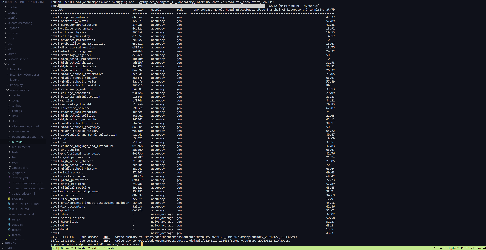
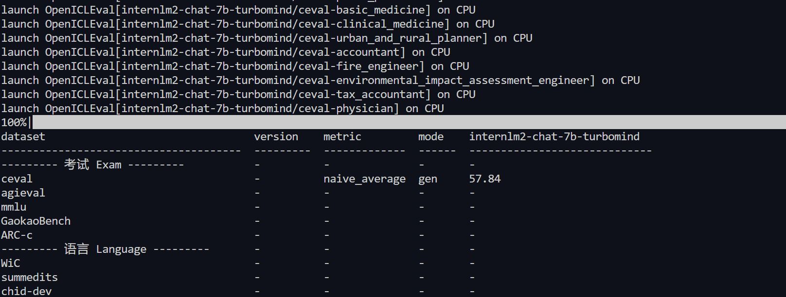
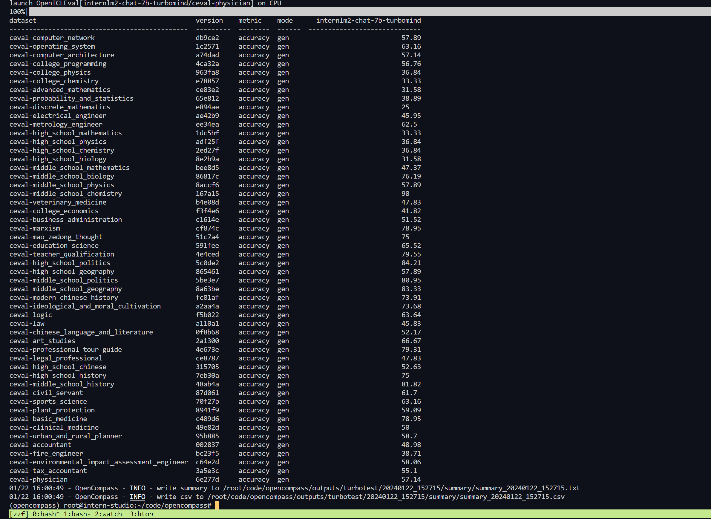

###  一、基础作业

直接使用InterLM2的进行评测

```bash
python run.py configs/eval_internlm2_chat_turbomind.py -w outputs/turbomind/internlm2-7b
```



###  二、进阶作业

对部署后的InternLM2模型进行opencompass评测

```bash
# 首先进行量化并转为turbomind格式
lmdeploy lite auto_awq /root/share/model_repos/internlm2-chat-7b  --work-dir internlm2-chat-7b-4bit
lmdeploy convert  internlm2-chat-7b ./internlm2-chat-7b-4bit/ --model-format awq --group-size 128  --dst-path  ./workspace_awq
```

最终实验结果如下，可以看到量化后的结果比原来的模型结果还要好一点，说明量化带来的变化经过网络后更好了，说明模型的鲁棒性较强，量化是一种正则化手段，提升了模型的性能。






