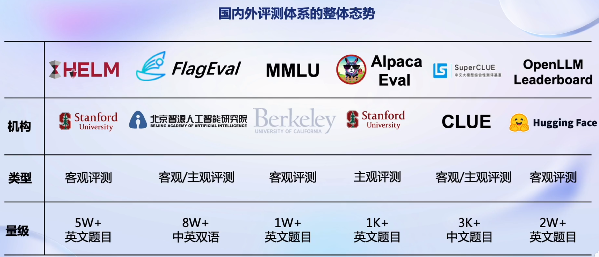
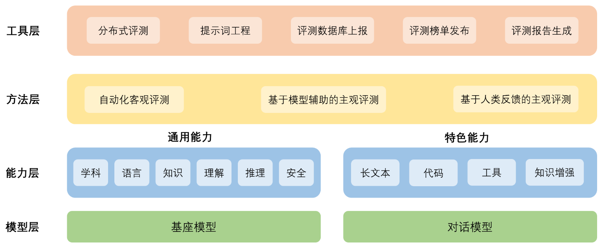
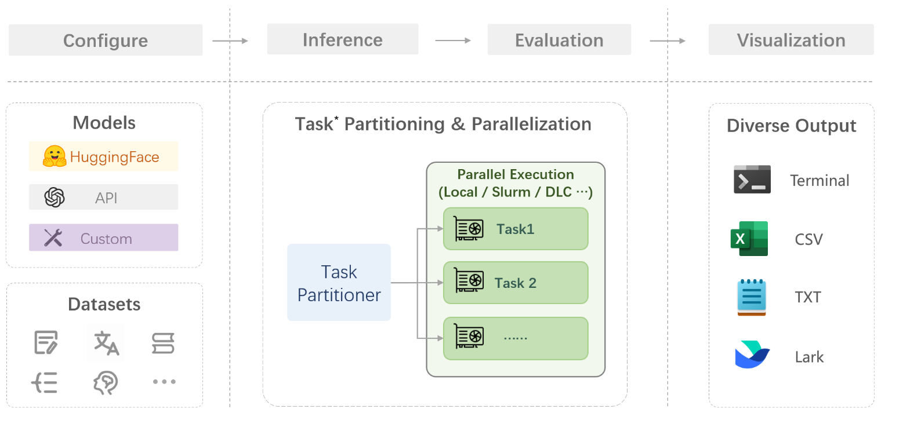

## 一、大模型评测研究现状

为了准确和公正地评估大模型的能力，国内外机构在大模型评测上开展了大量的尝试和探索。斯坦福大学提出了较为系统的评测框架HELM，从准确性，安全性，鲁棒性和公平性等维度开展模型评测。纽约大学联合谷歌和Meta提出了SuperGLUE评测集，从推理能力，常识理解，问答能力等方面入手，构建了包括8个子任务的大语言模型评测数据集。

加州大学伯克利分校提出了MMLU测试集，构建了涵盖高中和大学的多项考试，来评估模型的知识能力和推理能力。谷歌也提出了包含数理科学，编程代码，阅读理解，逻辑推理等子任务的评测集Big-Bench，涵盖200多个子任务，对模型能力进行系统化的评估。在中文评测方面，国内的学术机构也提出了如CLUE,CUGE等评测数据集，从文本分类，阅读理解，逻辑推理等方面评测语言模型的中文能力。




## 二、OpenCompass

本算法库的主要评测对象为语言大模型与多模态大模型。



- 模型层：大模型评测所涉及的主要模型种类，OpenCompass以基座模型和对话模型作为重点评测对象。
- 能力层：OpenCompass从本方案从通用能力和特色能力两个方面来进行评测维度设计。在模型通用能力方面，从语言、知识、理解、推理、安全等多个能力维度进行评测。在特色能力方面，从长文本、代码、工具、知识增强等维度进行评测。
- 方法层：OpenCompass采用客观评测与主观评测两种评测方式。客观评测能便捷地评估模型在具有确定答案（如选择，填空，封闭式问答等）的任务上的能力，主观评测能评估用户对模型回复的真实满意度，OpenCompass采用基于模型辅助的主观评测和基于人类反馈的主观评测两种方式。
- 工具层：OpenCompass提供丰富的功能支持自动化地开展大语言模型的高效评测。包括分布式评测技术，提示词工程，对接评测数据库，评测榜单发布，评测报告生成等诸多功能。

## 三、评测流程


配置 -> 推理 -> 评估 -> 可视化



**配置**：这是整个工作流的起点。您需要配置整个评估过程，选择要评估的模型和数据集。此外，还可以选择评估策略、计算后端等，并定义显示结果的方式。

**推理与评估**：在这个阶段，OpenCompass 将会开始对模型和数据集进行并行推理和评估。**推理**阶段主要是让模型从数据集产生输出，而**评估**阶段则是衡量这些输出与标准答案的匹配程度。这两个过程会被拆分为多个同时运行的“任务”以提高效率，但请注意，如果计算资源有限，这种策略可能会使评测变得更慢。

**可视化**：评估完成后，OpenCompass 将结果整理成易读的表格，并将其保存为 CSV 和 TXT 文件。你也可以激活飞书状态上报功能，此后可以在飞书客户端中及时获得评测状态报告。

## 四、实验

对internlm2模型利用compass框架在ceval数据集上进行评测，结果见作业文件夹。

```bash
python run.py --datasets ceval_gen --hf-path /root/model/Shanghai_AI_Laboratory/internlm2-chat-7b --tokenizer-path /root/model/Shanghai_AI_Laboratory/internlm2-chat-7b --tokenizer-kwargs padding_side='left' truncation='left' trust_remote_code=True --model-kwargs trust_remote_code=True device_map='auto' --max-seq-len 2048 --max-out-len 16 --batch-size 4 --num-gpus 1 --debug
```
